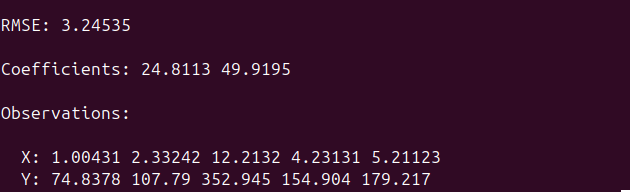

## Linear Regression with CUDA

### Introduction

This project was inspired by the realization of the linear regression in __sklearn__ (python ML library). I create basic functions to work with this model in C++ like in Python.

```

// you can split data into train and test
auto[x_train, y_train, x_test, y_test] = trainTestSplit(x, y, 0.7, 101, N); 

// you can initialize model, fit it and than  use to predict results
LinearModel model(x_train, y_train, x_test, y_test, train_size, test_size);

model.fit();

model.predict(x_, y_, 5);

// you can get the metric (RMSE) in order to analize accuracy
model.RMSE();
```

__At the moment__ model can work only with one feature however, in the future, I'm planning add the support of n-features

### Example of results:



### Requirements:

- CUDA
- C++17
